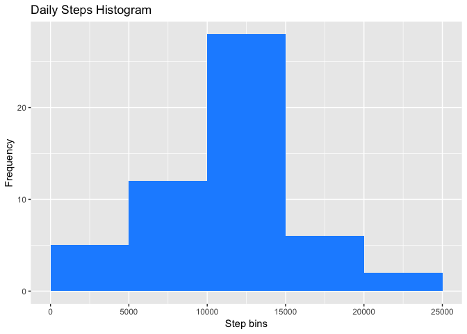
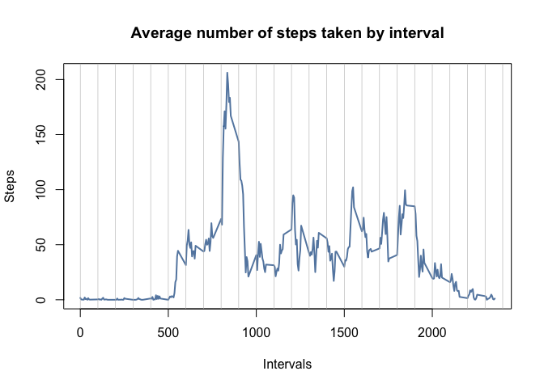
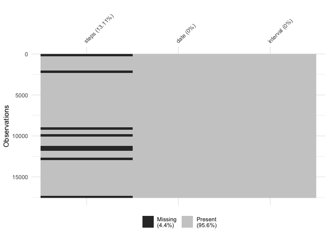
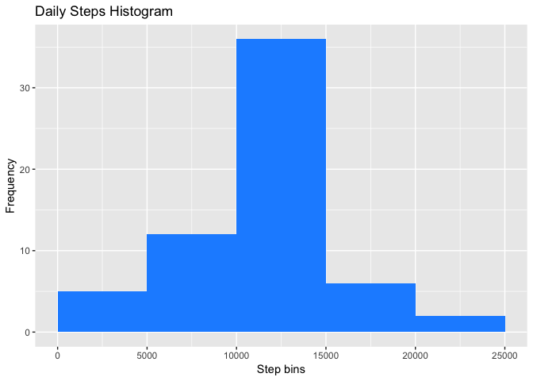
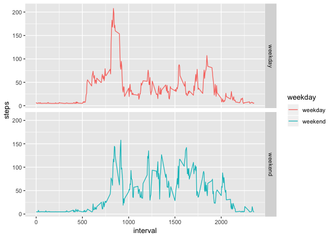

## 1. Loading and preprocessing the data

#### 1.1 Download and store data
Download the compressed file for analysis from [Activity_Data](https://d396qusza40orc.cloudfront.net/repdata%2Fdata%2Factivity.zip) if not already available in the data folder: **data**. Once dowloaded, read the csv into a R dataframe **activity_df**.


```r
files_for_analysis <- "https://d396qusza40orc.cloudfront.net/repdata%2Fdata%2Factivity.zip"
if(!file.exists("./data")){
        download.file(files_for_analysis, "activity_data.zip")
        unzip("activity_data.zip", exdir = "data")
}
activity_df <- read.csv("data/activity.csv", header = TRUE)
```

#### 1.2 Process/transform the data into a format suitable for analysis

Checking the data structure

```r
dim_data <- dim(activity_df)
str(activity_df)
```

```
## 'data.frame':	17568 obs. of  3 variables:
##  $ steps   : int  NA NA NA NA NA NA NA NA NA NA ...
##  $ date    : Factor w/ 61 levels "2012-10-01","2012-10-02",..: 1 1 1 1 1 1 1 1 1 1 ...
##  $ interval: int  0 5 10 15 20 25 30 35 40 45 ...
```
The dataset is composed of 17568 observations and 3 variables.
The date variable is currently created as a factor and should be changed to a *date* variable to facilitate analysis.


```r
activity_df$date <- as.Date(activity_df$date)
class(activity_df$date)
```

```
## [1] "Date"
```


```r
summary(activity_df)
```

```
##      steps             date               interval     
##  Min.   :  0.00   Min.   :2012-10-01   Min.   :   0.0  
##  1st Qu.:  0.00   1st Qu.:2012-10-16   1st Qu.: 588.8  
##  Median :  0.00   Median :2012-10-31   Median :1177.5  
##  Mean   : 37.38   Mean   :2012-10-31   Mean   :1177.5  
##  3rd Qu.: 12.00   3rd Qu.:2012-11-15   3rd Qu.:1766.2  
##  Max.   :806.00   Max.   :2012-11-30   Max.   :2355.0  
##  NA's   :2304
```
There are a number of NAs in the steps variable which will be ignored at this point.

## 2. What is mean total number of steps taken per day?

#### 2.1 Calculation of the total number of steps taken per day


```r
steps_day <- aggregate(steps~date, activity_df, sum)
head(steps_day)
```

```
##         date steps
## 1 2012-10-02   126
## 2 2012-10-03 11352
## 3 2012-10-04 12116
## 4 2012-10-05 13294
## 5 2012-10-06 15420
## 6 2012-10-07 11015
```

#### 2.2 Histogram of the total number of steps taken each day


```r
ggplot2::qplot(steps_day$steps,
               geom = "histogram",
               binwidth = 5000,
               main = "Daily Steps Histogram",
               xlab = "Step bins",
               ylab = "Frequency",
               breaks = seq(0,25000, by=5000),
               fill = I("dodgerblue"))
```

<!-- -->

#### 2.3 Mean and median of the total number of steps taken per day

Here is a summary of the stats for the total number of steps taken per day - from the variable **steps_day$steps**:

```r
summary(steps_day$steps)
```

```
##    Min. 1st Qu.  Median    Mean 3rd Qu.    Max. 
##      41    8841   10765   10766   13294   21194
```

The average number of steps taken each day was 10766 and the median was 10765.


## 3. What is the average daily activity pattern?

#### 3.1 Plot of the 5-minute interval (x-axis) and the average number of steps taken, averaged across all days (y-axis):

```r
mean_interval <- aggregate(steps ~ interval, activity_df,mean)

plot(mean_interval$interval,
     mean_interval$steps,
     type = "l",
     xlab = "Intervals",
     ylab = "Steps",
     main = "Average number of steps taken by interval",
     lwd = 2,
     col=rgb(0.2,0.4,0.6,0.8))

abline(v=seq(0,25000,100) , col="grey" , lwd=0.6)
```

<!-- -->

#### 3.2 Which 5-minute interval, on average across all the days in the dataset, contains the maximum number of steps?


```r
max_steps <- max(mean_interval$steps)
max_intv <- mean_interval[which(mean_interval$steps == max_steps), 1]
```

The 5 minutes interval with the maximum number of steps is interval 835 with 206.1698113 steps.


## 4. Imputing missing values

#### 4.1 Calculation of the total number of missing values in the dataset (i.e. the total number of rows with NA)

For this sections, I will be using a stats package that provides special functions to deal with missing data: "naniar".


```r
library(naniar)

no_observations <- NROW(activity_df$steps)

# Summary and visualisation of missing values by variable
miss_var_summary(activity_df)
```

```
## # A tibble: 3 x 3
##   variable n_miss pct_miss
##   <chr>     <int>    <dbl>
## 1 steps      2304     13.1
## 2 date          0      0  
## 3 interval      0      0
```

```r
vis_miss(activity_df)
```

<!-- -->

```r
# No NA's missing
no_nas <- n_miss(activity_df)

# Proportion of NA's missing from total number of datapoints - equivalent to "mean(is.na(activity_df)) *100""
no_na_perc <- round(pct_miss(activity_df),1)
```

The total number of missing values in the dataset is 2304 out of a total of 17568 observations or 4.4% of the total datapoints i.e. across all three variables.

#### 4.2 Strategy to replace the missing values in the dataset
The strategy devised to remove the missing values in this dataset is to replace them with the mean using the function **impute_mean** from the **naniar** package.

#### 4.3 Creation of a new dataset, equal to the original dataset but with the missing data filled in.


```r
activity_no_nas_df <- activity_df
activity_no_nas_df$steps <- impute_mean(activity_df$steps)
miss_var_summary(activity_no_nas_df)
```

```
## # A tibble: 3 x 3
##   variable n_miss pct_miss
##   <chr>     <int>    <dbl>
## 1 steps         0        0
## 2 date          0        0
## 3 interval      0        0
```

### 4.4 Histogram of the total number of steps taken each day after removing NA's


```r
# Re-calculate steps by day after imputing data
steps_day_new <- aggregate(steps~date, activity_no_nas_df, sum)

ggplot2::qplot(steps_day_new$steps,
               geom = "histogram",
               binwidth = 5000,
               main = "Daily Steps Histogram",
               xlab = "Step bins",
               ylab = "Frequency",
               breaks = seq(0,25000, by=5000),
               fill = I("dodgerblue"))
```

<!-- -->

Are there any differences between between the estimates from the first part of the assignment? What is the impact of imputing missing data on the estimates of the total daily number of steps? To answer these questions, lets compare the distribution of the data before and after imputing missing values:


```r
## Summary of steps/day before data imputing
summary(steps_day)
```

```
##       date                steps      
##  Min.   :2012-10-02   Min.   :   41  
##  1st Qu.:2012-10-16   1st Qu.: 8841  
##  Median :2012-10-29   Median :10765  
##  Mean   :2012-10-30   Mean   :10766  
##  3rd Qu.:2012-11-16   3rd Qu.:13294  
##  Max.   :2012-11-29   Max.   :21194
```

```r
## Summary of steps/day after data imputing
summary(steps_day_new)
```

```
##       date                steps      
##  Min.   :2012-10-01   Min.   :   41  
##  1st Qu.:2012-10-16   1st Qu.: 9819  
##  Median :2012-10-31   Median :10766  
##  Mean   :2012-10-31   Mean   :10766  
##  3rd Qu.:2012-11-15   3rd Qu.:12811  
##  Max.   :2012-11-30   Max.   :21194
```

There was not a big change in the median value and the mean value remained the same. This is because of the method used for imputing missing data - mean. The main differences observed are in the 1st and 3rd quartiles.


## 5. Are there differences in activity patterns between weekdays and weekends?


#### 5.1 Creation of Week Day factor variable
Creation of a new factor variable in the dataset with two levels – “weekday” and “weekend” indicating whether a given date is a weekday or weekend day.


```r
library(dplyr, quietly = TRUE, warn.conflicts = FALSE)
activity_no_nas_df <- activity_no_nas_df %>%
        mutate(dayofw = weekdays(date, abbreviate = TRUE)) %>%
        mutate(weekday = as.factor(if_else((dayofw == "Sat" | dayofw == "Sun"), "weekend", "weekday")))

str(activity_no_nas_df)
```

```
## 'data.frame':	17568 obs. of  5 variables:
##  $ steps   : num  37.4 37.4 37.4 37.4 37.4 ...
##  $ date    : Date, format: "2012-10-01" "2012-10-01" ...
##  $ interval: int  0 5 10 15 20 25 30 35 40 45 ...
##  $ dayofw  : chr  "Mon" "Mon" "Mon" "Mon" ...
##  $ weekday : Factor w/ 2 levels "weekday","weekend": 1 1 1 1 1 1 1 1 1 1 ...
```


#### 5.2 Time series plot of the 5-minute interval (x-axis) and the average number of steps taken, averaged across all weekday days or weekend days (y-axis).  


```r
library(ggplot2)

mean5interval <- aggregate(steps ~ interval + weekday, activity_no_nas_df,mean)

ggplot(mean5interval, aes(x = interval, y =  steps, colour = weekday)) + 
        geom_line() +
        facet_grid(weekday~.)
```

<!-- -->
